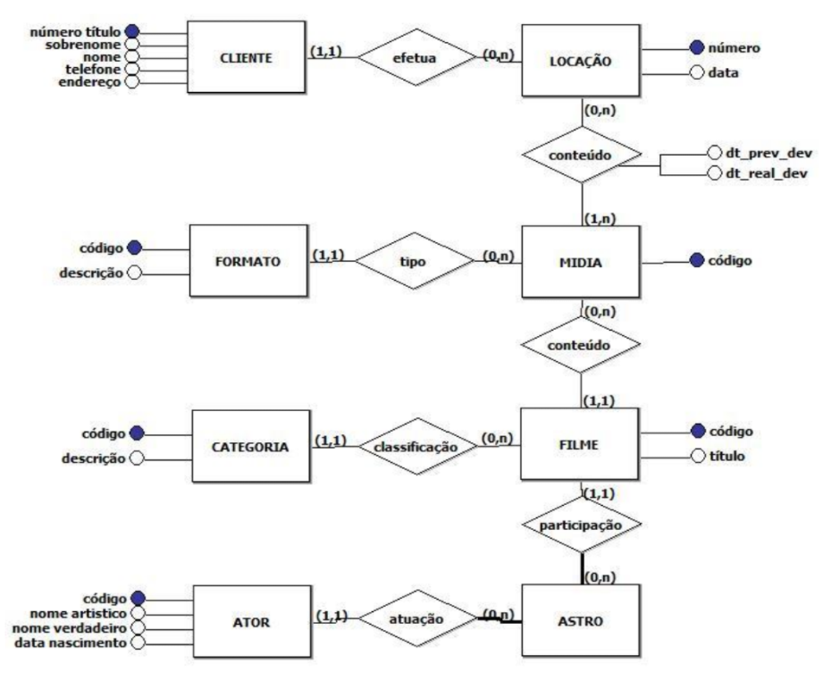

# Exercício 1 – Controle de Locações

### Sou o proprietário de uma pequena loja de vídeo. Temos mais de 3000 mídias aqui e queremos um sistema para controlá-las. Cada mídia contém um número. Para cada filme, precisamos saber seu título e categoria (comédia, suspense, terror, etc). Muitos de nossos filmes têm mais de uma cópia. A cada filme, fornecemos um código e então controlamos qual filme uma mídia contém. O formato de uma mídia pode ser DVD, VCD ou VHS, e gostaríamos de deixar o sistema preparado para cadastro de novos formatos de mídia que vierem a ser lançadas. Sempre temos uma mídia para cada filme, e cada mídia tem apenas um filme. Não temos aqui nenhum filme que requeira mais de uma mídia. Frequentemente, as pessoas alugam filmes pelos atores. John Wayne e Katherine Turner são muito populares.

### Queremos manter informações sobre os astros que atuam em nossos filmes. Nem todos os filmes são estrelados por astros e só mantemos aqui astros que atuam em filmes de nosso catálogo. Os clientes gostam de saber a data de nascimento de um astro, bem como seu verdadeiro nome. Temos muitos clientes. Apenas alugamos filmes para pessoas inscritas em nosso vídeo clube. Para cada membro do clube mantemos seu primeiro e último nome, telefone e endereço. Claro que cada membro possui um número de título. Além disso mantemos o status de crédito de cada um.

### Queremos controlar os aluguéis de filmes. Um cliente pode alugar vários filmes ao mesmo tempo. Precisamos manter o histórico de nossos aluguéis. Cada vez que um cliente aluga uma mídia, queremos manter a data do aluguel e a data do retorno. Mantendo este histórico de aluguel, seremos capazes de analisar o padrão de nossos aluguéis. Poderemos determinar quantas fitas cada cliente aluga e quantas vezes um cliente devolveu a fita em atraso. Seremos capazes de saber quantas fitas em particular foi usada, e então saberemos quando retirar cada fita. Também seremos capazes de analisar as preferências de filmes de nossos clientes.

#

# Resolução

# 
  

