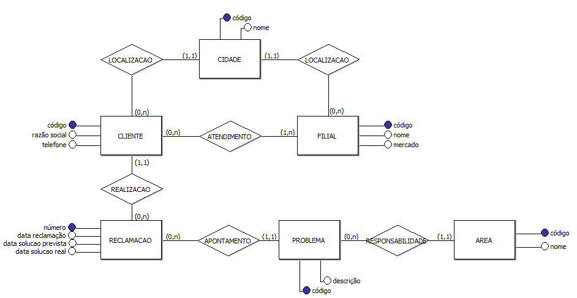

# Exercício 2 - Registro de Reclamações para Veículos

### Determinada empresa, que fabrica carros “Séries Especiais”, pretende desenvolver um sistema para controle de Reclamações efetuadas por seus clientes. Esta empresa possui Filiais no Mercado Interno e Externo, sendo que cada cliente é atendido pela filial mais próxima de sua cidade. Para cada filial, necessário guardar no sistema seu código, nome, cidade e mercado que atua (interno ou externo). Os dados do cliente que necessitam ser guardados são os seguintes: código, razão social, telefone, cidade. Quando o cliente liga reclamando de um problema, é aberto um registro na tabela de reclamação onde é apontado: número da reclamação, código do cliente, a data da reclamação, código do problema ocorrido, qual a data prevista de solução do problema.

### Quando problema é resolvido, é registrada a data de solução real, afim de se efetuar estatística quanto ao desempenho das equipes responsáveis. Cada reclamação aponta um problema. Se o mesmo cliente aponta mais de um problema, para cada problema é criada uma reclamação. Para cada problema é necessário guardar seu código e descrição, bem como a área responsável por este problema. Cada problema possui uma área responsável e, uma área pode ser responsável por vários problemas.

#

# Resolução

# 
