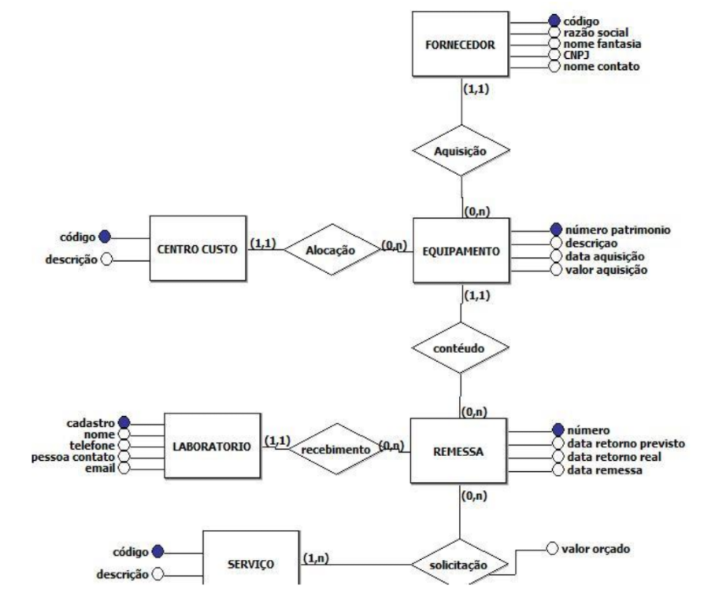

# Exercício 3- Estudo de Caso: Controle Serviços Externos Departamento Metrologia

### Determinada empresa possui um departamento de metrologia responsável por aferições de equipamentos nela utilizados. Determinadas tarefas são realizadas em laboratório de terceiros. Então, faz-se necessário o controle de remessas desses equipamentos através de um sistema de informação simples:

### Cada equipamento recebe um número de patrimônio (NP) e é alocado em um determinado centro de custo, que por sua vez, é identificado também por um código e descrição. Por centro de custo entende-se um departamento da empresa, onde são alocados e rateados custos, despesas e investimentos. Um centro de custo pode ser vários equipamentos alocados. Além disso, para cada equipamento é necessário conhecer: sua descrição, data e valor de aquisição.

### O equipamento é comprado de um determinado fornecedor, do qual é armazenado no sistema um código, razão social, nome fantasia, CNPJ e telefone de contato. De um mesmo fornecedor, é possível comprar vários equipamentos. A empresa realiza em laboratórios terceirizados de metrologia determinados tipos de serviço, que são: calibração, conserto, testes de conformidade. Para estes laboratórios terceirizados, é necessário armazenar no sistema um número de cadastro, nome do laboratório de metrologia, telefone, e-mail e pessoa de contato.

### Para cada equipamento enviado à terceiros, é criado um controle que consiste em um número seqüencial de remessa, identificação do equipamento, laboratório ao qual foi enviado o equipamento, data de remessa, data de retorno previsto e data real de retorno. Um equipamento pode sofrer vários serviços numa remessa, na qual é necessário identificar o tipo de serviço e o valor orçado para o mesmo. Cada remessa refere-se a somente um equipamento.

#

# Resolução

# 
