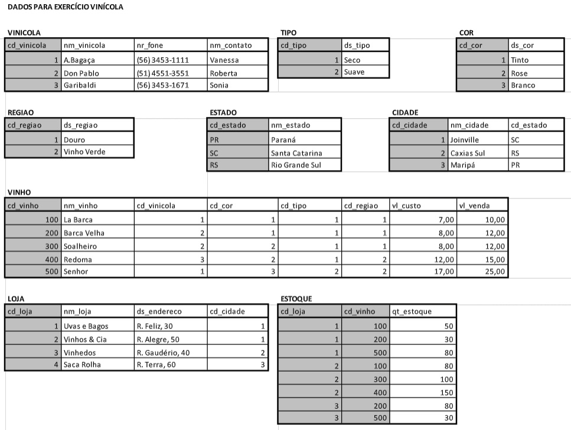

# Exercício Prático Laboratório: Comandos DML/SQL

## Analise o BD abaixo, utilizado em uma distribuidora de vinhos, para controle dos estoques de suas lojas:

---

# <center>  </center>

## 1 - Liste o nome dos vinhos, e a soma dos estoque (quantidade) de todas as lojas estabelecidas no estado de “Santa Catarina”.

---

## Resolução

```sql
SELECT V.NM_VINHO, SUM(E.QT_ESTOQUE)
FROM VINHO V, ESTOQUE E, LOJA L, CIDADE C
WHERE E.CD_VINHO = V.CD_VINHO
AND E.CD_LOJA = L.CD_LOJA
AND L.CD_CIDADE = C.CD_CIDADE
AND C.CD_ESTADO = 'SC'
GROUP BY V.NM_VINHO
```

---

## 2 - Para os vinhos produzidos pela vinícola Don Pablo, retorne: nome do vinho, descrição da região e cor, bem como o seu valor de venda.

---

## Resolução

```sql
SELECT V.NM_VINHO, R.DS_REGIAO, C.DS_COR, V.VL_VENDA
FROM VINHO V, VINICOLA VINI, REGIAO R, COR C
WHERE VINI.CD_VINICOLA = '2'
AND V.CD_VINICOLA = VINI.CD_VINICOLA
AND V.CD_COR = C.CD_COR
GROUP BY V.NM_VINHO
```

---

## 3 - Para o estado do Rio Grande do Sul, retorne o nome das lojas e suas respectivas cidades.

---

## Resolução

```sql
SELECT L.NM_LOJA, C.NM_CIDADE
FROM LOJA L, CIDADE C
WHERE C.CD_ESTADO = 'RS'
AND L.CD_CIDADE = C.CD_CIDADE
GROUP BY L.NM_LOJA
```

---

## 4 - Retorne a quantidade dos vinhos do estoques, agrupados por nome de vinho.

---

## Resolução

```sql
SELECT V.NM_VINHO, SUM(E.QT_ESTOQUE)
FROM VINHO V, ESTOQUE E
WHERE V.CD_VINHO = E.CD_VINHO
GROUP BY V.NM_VINHO
```

---

## 5 - Promova um aumento de 10% no valor de venda do vinho Barca Velha.

---

## Resolução

```sql
UPDATE VINHO
SET VL_VENDA = VL_VENDA * 1.10
WHERE NM_VINHO = 'Barca Velha'
```
