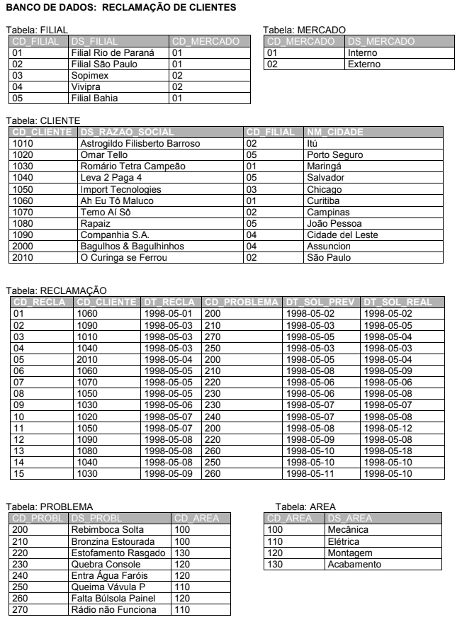

# Exercício DML/SQL Banco de Dados Reclamação

## Resolva as questões abaixo usando sentenças SQL. Após a resolução, transcreva o comando utilizado para cada questão.

---

# <center>  </center>

## 1 - Liste o código da reclamação, nome do cliente e a descrição do problema, das reclamações de responsabilidade da área elétrica que ocorreram entre 05.05.1998 à 10.05.1998.

---

## Resolução

```sql
select r.cd_recla, c.ds_razao_social, p.ds_problema
from reclamacao r, cliente c, problema p, area a
where a.ds_area = 'Elétrica'
and r.dt_recla between '1998-05-05' and '1998-05-10'
and r.cd_cliente = c.cd_cliente
and r.cd_problema = p.cd_problema
and p.cd_area = a.cd_area
```

---

## 2 - Qual a razão social dos clientes que pertencem às filiais do Mercado Externo?

---

## Resolução

```sql
select c.ds_razao_social
from cliente c, filial f, mercado m
where m.ds_mercado = 'Externo'
and c.cd_filial = f.cd_filial
and m.cd_mercado = f.cd_mercado
```

---

## 3 - Quantos clientes a filial Bahia possui?

---

## Resolução

```sql
select count(c.ds_razao_social) 'Quantidade de Clientes'
from cliente c, filial f
where f.ds_filial = 'Filial Bahia'
and c.cd_filial = f.cd_filial
```

---

## 4 - Liste a razão social, cidade e filial dos clientes que reclamaram no período de 03.05.1998 à 07.05.1998 (nota: não repita o mesmo cliente).

---

## Resolução

```sql
select distinct c.ds_razao_social, c.nm_cidade, f.ds_filial
from cliente c, filial f, reclamacao r
where r.dt_recla between '1998-05-03' and '1998-05-07'
and c.cd_filial = f.cd_filial
and r.cd_cliente = c.cd_cliente
```

---

## 5 - Liste o código da reclamação, a razão social do cliente, a descrição do problema, das reclamações que tiveram sua solução real igual a solução prevista.

---

## Resolução

```sql
select r.cd_recla, c.ds_razao_social, p.ds_problema
from reclamacao r, cliente c, problema p
where r.dt_sol_real = r.dt_sol_prev
and r.cd_cliente = c.cd_cliente
and p.cd_problema = r.cd_problema
```

---

## 6 - Liste o código da reclamação, a razão social dos clientes, a área do problema, a data de solução prevista, a data de solução real, para as reclamações que atrasaram mais de 2 dias para serem resolvidas (considerar a data prevista e a data real de solução).

---

## Resolução

```sql
select r.cd_recla, c.ds_razao_social, a.ds_area, r.dt_sol_prev, r.dt_sol_real
from reclamacao r, cliente c, area a, problema p
where datediff(r.dt_sol_real, r.dt_sol_prev) > 2
and r.cd_cliente = c.cd_cliente
and p.cd_area = a.cd_area
and r.cd_problema = p.cd_problema
```

---

## 7 - Liste a razão social e a filial dos clientes do Mercado Interno que reclamaram de problemas de montagem e que tiveram a solução dos seus problemas depois do dia 06.05.1998.

---

## Resolução

```sql
select distinct c.ds_razao_social, f.ds_filial
from cliente c, filial f, mercado m, area a, reclamacao r, problema p
where m.ds_mercado = 'Interno'
and a.ds_area = 'Montagem'
and r.dt_sol_real > '1998-05-06'
and f.cd_mercado = m.cd_mercado
and c.cd_filial = f.cd_filial
and p.cd_area = a.cd_area
and r.cd_problema = p.cd_problema
and c.cd_cliente = r.cd_cliente
```

---

## 8 - Insira um novo cliente para a filial São Paulo.

---

## Resolução

```sql
insert into cliente values (2020, 'Lucas Leoni', 02, 'São Paulo')
```

---

## 9 - Altere a descrição do problema ‘Rádio não Funciona’ para ‘O Rádio é uma Porcaria’.

---

## Resolução

```sql
update problema
set ds_problema = 'O Rádio é uma Porcaria'
where ds_problema = 'Rádio não Funciona'
```
