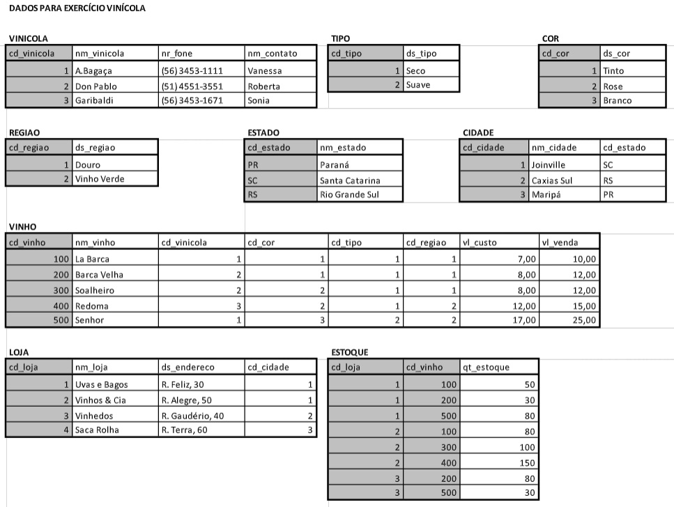

# Exercício DML/SQL Banco de Dados Vinícola

# 

## 1 - Obtenha o nome dos vinhos, seus valores de custo e de venda, o nome da vinícola, a descrição da região, a descrição da cor e do tipo, que fazem parte do estoque das lojas localizadas no estado do Rio Grande do Sul.

### Resolução

```sql
select v.nm_vinho, v.vl_custo, v.vl_venda, va.nm_vinicola, r.ds_regiao, c.ds_cor, t.ds_tipo
from vinho v, vinicola va, regiao r, cor c, tipo t, estoque e, loja l, cidade ci
where v.cd_vinicola = va.cd_vinicola
and v.cd_regiao = r.cd_regiao
and v.cd_cor = c.cd_cor
and v.cd_tipo = t.cd_tipo
and e.cd_vinho = v.cd_vinho
and l.cd_loja = e.cd_loja
and ci.cd_cidade = l.cd_cidade
and ci.cd_estado = 'RS'
```

## 2 - Retornar o nome, o nr do fone e o nome da cidade das lojas que possuem em seus estoques uma quantidade menor que 20 garrafas do vinho “Redoma”.

### Resolução

```sql
select l.nm_loja, va.nr_fone, c.nm_cidade
from loja l, vinicola va, cidade c, vinho v, estoque e
where v.cd_vinicola = va.cd_vinicola
and e.cd_vinho = v.cd_vinho
and l.cd_loja = e.cd_loja
and c.cd_cidade = l.cd_cidade
and v.nm_vinho = 'Redoma'
and e.qt_estoque < 20
```

## 3 - Liste o nome dos vinhos, e a soma dos estoques (quantidade) de todas as lojas estabelecidas no estado de “Santa Catarina”.

### Resolução

```sql
select v.nm_vinho, sum(qt_estoque) 'soma_estoque'
from vinho v, estoque e, loja l, cidade c
where e.cd_vinho = v.cd_vinho
and l.cd_loja = e.cd_loja
and c.cd_cidade = l.cd_cidade
and c.cd_estado = 'SC'
group by v.nm_vinho
```

## 4 - Retorne o nome das lojas e o valor dos seus estoques (considerando quantidade e valor de venda dos vinhos) . Considerar somente estoques com valor superior a R$ 2.000,00. Classificar pelo valor do maior estoque.

### Resolução

```sql
select l.nm_loja, sum(e.qt_estoque * v.vl_venda) 'vl_estoque'
from loja l, estoque e, vinho v
where e.cd_loja = l.cd_loja
and e.cd_vinho = v.cd_vinho
group by nm_loja
having vl_estoque > 2000.00
order by vl_estoque desc
```

## 5 - Retorne por Estado, o número total de Lojas.

### Resolução

```sql
select e.nm_estado, count(l.cd_loja) 'qt_loja'
from estado e, loja l, cidade c
where c.cd_estado = e.cd_estado
and l.cd_cidade = c.cd_cidade
group by nm_estado
```

## 6 - Promova um aumento de 10% no valor de venda para todos os vinhos fornecidos pela Vinícola “Don Pablo”.

### Resolução

```sql
update vinho
set vl_venda = vl_venda + (vl_venda * 0.10)
where cd_vinicola = 2
```
