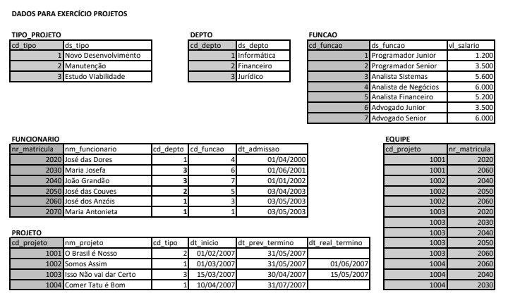

# Exercício DML/SQL Banco de Dados Projetos

# 

## 1 - Obtenha a matricula, o nome dos funcionários, a descrição dos departamentos, bem como o valor dos salários, dos funcionários que estão participando de projetos do tipo “Novo Desenvolvimento”.

### Resolução

```sql
select distinct f.nr_matricula, f.nm_funcionario, d.ds_depto, fu.vl_salario
from funcionario f, depto d, funcao fu, equipe e, projeto p
where d.cd_depto = f.cd_depto
and fu.cd_funcao = f.cd_funcao
and e.nr_matricula = f.nr_matricula
and p.cd_projeto = e.cd_projeto
and p.cd_tipo = 1
```

## 2 - Obtenha a soma dos salários de todos os funcionários envolvidos nos projetos do tipo “Manutenção”, agrupados por descrição do departamento, em ordem decrescente. Retorne somente os departamentos cujo soma dos salários seja superior a R$ 15.000,00.

### Resolução

```sql
select sum(f.vl_salario) 'soma_salario'
from funcao f, depto d, funcionario fu, equipe e, projeto p
where fu.cd_funcao = f.cd_funcao
and fu.cd_depto = d.cd_depto
and e.nr_matricula = fu.nr_matricula
and p.cd_projeto = e.cd_projeto
and p.cd_tipo = 2
group by d.ds_depto
having soma_salario > 15000.00
order by soma_salario desc
```

## 3 - Obtenha a média salarial anual dos funcionários que participam do projeto “Isso não vai dar certo”, agrupando por departamento, em ordem decrescente.

### Resolução

```sql
select round(12 * avg(f.vl_salario), 2) 'media_salarial_anual'
from funcao f, funcionario fu, depto d, equipe e
where fu.cd_funcao = f.cd_funcao
and fu.cd_depto = d.cd_depto
and e.cd_projeto = 1003
group by d.cd_depto
order by media_salarial_anual desc
```

## 4 - Liste o nome, a função e o salário de todos os funcionários da Área “Informática” que não estão participando de nenhum projeto.

### Resolução

```sql
select f.nm_funcionario, fu.ds_funcao, fu.vl_salario
from funcionario f, funcao fu
where fu.cd_funcao = f.cd_funcao
and f.cd_depto = 1
and not exists (select * from equipe e where f.nr_matricula = e.nr_matricula)
```
