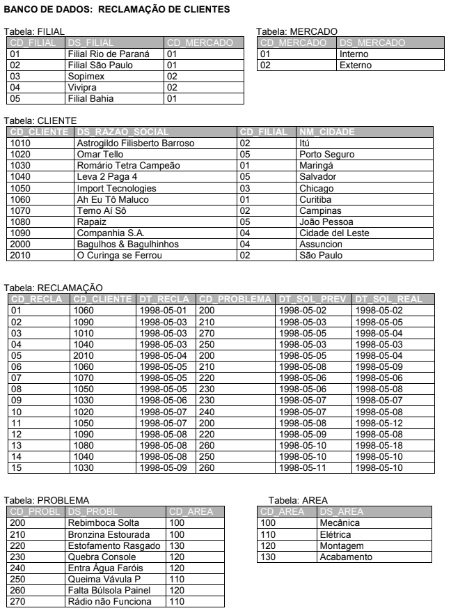

# Exercício DML/SQL Banco de Dados Reclamação

## Considerando o Banco de Dados Reclamação, resolva as seguintes questões utilizando comandos DML/SQL:

---

# <center>  </center>

## 1 - Para os clientes atendidos pela Filial Vivipra, retorne o código, Razão Social e Cidade.

---

## Resolução

```sql
select c.cd_cliente, c.ds_razao_social, c.nm_cidade
from cliente c, filial f
where c.cd_filial = f.cd_filial
and f.ds_filial = 'Vivipra'
```

---

## 2 - Quantas reclamações ocorreram entre os dias 06/05 a 09/05 de 1998?

---

## Resolução

```sql
select count(r.cd_recla) 'qtd_reclamacoes'
from reclamacao r
where r.dt_recla between '1998-05-06' and '1998-05-09'
```

---

## 3 - Retorne a Razão Social, Cidade e a Descrição das Filiais para os clientes que tiveram atraso na resolução de suas reclamações.

---

## Resolução

```sql
select distinct c.ds_razao_social, c.nm_cidade, f.ds_filial
from cliente c, filial f, reclamacao r
where c.cd_filial = f.cd_filial
and r.cd_cliente = c.cd_cliente
and datediff(r.dt_sol_real, r.dt_sol_prev) > 0
```

---

## 4 - Quais os problemas da Área de Montagem foram reclamados por clientes do Mercado Interno?

---

## Resolução

```sql
select distinct p.ds_problema
from problema p, area a, reclamacao r, cliente c, filial f, mercado m
where p.cd_area = a.cd_area
and r.cd_problema = p.cd_problema
and r.cd_cliente = c.cd_cliente
and c.cd_filial = f.cd_filial
and f.cd_mercado = m.cd_mercado
and a.ds_area = 'Montagem'
and m.ds_mercado = 'Interno'
```

---

## 5 - Retorne a quantidade de reclamações, agrupadas por Descrição da Área.

---

## Resolução

```sql
select count(r.cd_recla) 'qtd_reclamacoes', a.ds_area
from reclamacao r, area a, problema p
where p.cd_area = a.cd_area
and r.cd_problema = p.cd_problema
group by a.ds_area
```

---

## 6 - Retorne a quantidade de reclamações, agrupadas por Descrição de Mercado. Somente retorne os mercados que tiveram mais de 3 reclamações. Liste primeiro os mercados com maior quantidade de reclamação.

---

## Resolução

```sql
select count(r.cd_recla) 'qtd_reclamacoes', m.ds_mercado
from reclamacao r, mercado m, cliente c, filial f
where r.cd_cliente = c.cd_cliente
and c.cd_filial = f.cd_filial
and f.cd_mercado = m.cd_mercado
group by m.ds_mercado
having count(r.cd_recla) > 3
order by count(r.cd_recla) desc
```
